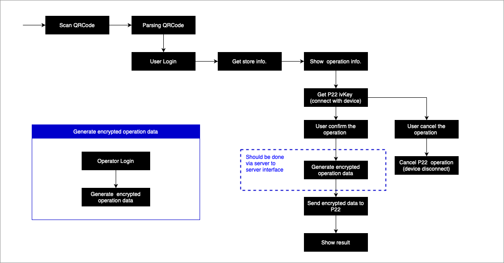

#   SecuXPaymentKitSample  
The secux-paymentkit-sample-for-springtrees-ios is a sample APP for showing how to scan
the QRCode from P22 and confirm the promotion / payment / refill to the P22 device via secux-paymentkit-v2. 

# secux-paymentkit-v2

[](https://cocoapods.org/pods/secux-paymentkit-v2)
[](https://cocoapods.org/pods/secux-paymentkit-v2)
[](https://cocoapods.org/pods/secux-paymentkit-v2)

## Example

To run the example project, clone the repo, and run `pod install` from the Example directory first.

## Requirements

iOS 12+ , Swift 5

## Installation

secux-paymentkit-v2 is available through [CocoaPods](https://cocoapods.org). To install
it, simply add the following line to your Podfile:

```ruby
pod 'secux-paymentkit-v2'
```

### Add bluetooth privacy permissions in the plist


### Import the module

```swift 
    import secux_paymentkit_v2
    import secux_paymentdevicekit
```

## Usage

### SecuXAccount related API

Create SecuXAccountManager object
```swift
    let accManager = SecuXAccountManager()
```

1. <b>Merchant Login</b>

Must login the assigned merchant account before calling payment related APIs.

Note: <span style="color:red">Login session is valid for 30 minutes</span>. To continue use after 30 minutes, relogin is required.

SecuX Server API:
<a href="https://documenter.getpostman.com/view/9715663/SzfDvj4S?version=latest#76b3bbc9-2853-42c4-823b-3e0d47d58cf6">/api/Admin/Login</a>


#### <u>Declaration</u>
```swift
    func loginMerchantAccount(accountName:String, password:String) 
                                                -> (SecuXRequestResult, Data?)
```
#### <u>Parameter</u>
```
    accountName:    Merchant account name.
    password:       Merchant account password.
```

#### <u>Return value</u>
```
    SecuXRequestResult shows the operation result. If the result is SecuXRequestOK, 
    login is successful, otherwise login failed and data might contain an error message.
```

#### <u>Sample</u>
```swift
    func login(name:String, password:String) -> Bool{
        let (ret, data) = accountManager.loginMerchantAccount(accountName: name, 
                                                              password: password)
        guard ret == SecuXRequestResult.SecuXRequestOK else{
            print("login failed!")
            if let data = data, 
               let error = String(data: data, encoding: String.Encoding.utf8)  {
                print("Error: \(error)")
            }
            return false
        }
        
        return true
    }
```

### SecuXPayment related APIs

Create SecuXPaymentManager object

```swift
    let paymentManager = SecuXPaymentManager()
```

1. <b>Get store information</b>

Get store information via the hashed device ID in P22 QRCode.

SecuX Server API:

<a href="https://documenter.getpostman.com/view/9715663/SzfDvj4S?version=latest#136613f8-648a-4c76-b4bc-9edc00943aad">/api/Terminal/GetStore</a>

#### <u>Declaration</u>
```swift
    func getStoreInfo(devID:String) 
                    -> (SecuXRequestResult, String, SecuXStoreInfo?)
```
#### <u>Parameter</u>
```
    devID: Hashed device ID from P22 QRCode
```
#### <u>Return value</u>
```
    SecuXRequestResult shows the operation result. If the result is SecuXRequestOK, 
    getting store information is successfully, store information is in the SecuXStoreInfo, 
    otherwise getting store information is failed and string might contain an error message.

    Note: if return result is SecuXRequestNoToken / SecuXRequestUnauthorized, the login 
    session is timeout, please relogin the system.

    SecuXStoreInfo contains store code, store name, store icon, store device id and 
    store supported coin/token array
```
#### <u>Sample</u>
```swift
    let (ret, error, storeInfo) = paymentManager.getStoreInfo(devID: devIDHash)
        
    guard ret == SecuXRequestResult.SecuXRequestOK else{
        self.showMessageInMainThread(title: "Get store info. failed!", 
                                   message: "Error: \(error)")
        return
    }
    
    guard let devID = storeInfo?.devID else{
        self.showMessageInMainThread(title: "Invalid store info. no device ID", 
                                   message: "")
        return
    }
```

2. <b>Do check-in / promotation / payment / refill operation</b>

Confirm the check-in/promotation/payment/refill operation to the P22 device.



2.1 SecuX Server APIs:

- Login operator account
<a href="https://documenter.getpostman.com/view/9715663/SzfDvj4S?version=latest#76b3bbc9-2853-42c4-823b-3e0d47d58cf6">/api/Admin/Login</a>

- Encrypt operation data 
<a href="https://documenter.getpostman.com/view/9715663/SzfDvj4S?version=latest#ff393d68-3045-451f-b175-3721f3281d74">/api/B2B/ProduceCipher</a>

2.2 SecuX Device APIs:

Please refer to the  <a href="https://github.com/secuxtech/secux-paymentdevicekit-framework-sample-ios">secux_paymentdevicekit</a> for the APIs below:
- Get P22 ivKey

- Cancel operation

- Send encrypted operation data to P22


## Author

maochuns, maochunsun@secuxtech.com

## License

secux-paymentkit is available under the MIT license. 

